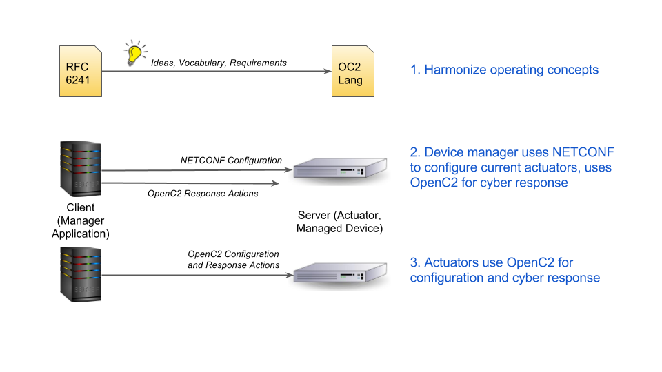

# NETCONF
This use case discusses the relationship between OpenC2 and NETCONF and possible interactions between them.  Interactions include:

1. Use NETCONF requirements as candidates for OpenC2 use cases
2. Define mechanisms for OpenC2 management applications to control unmodified NETCONF actuators (using a common operational model to enable simple OpenC2-to-NETCONF translation)
3. Define OpenC2 commands to perform base NETCONF operations

Because the goal of OpenC2 is to create a vendor-agnostic common command set, defining vendor-specific OpenC2 commands to perform extended NETCONF capabilities is explicitly out of scope.
## NETCONF Protocol
The Network Configuration Protocol (NETCONF) is a network management
protocol developed and standardized by the IETF in
[RFC 6241](https://tools.ietf.org/html/rfc6241).
NETCONF provides mechanisms to install, manipulate, and delete the
configuration of network devices, and supports robust configuration
change using transactions involving a number of devices.
Its operations are realized on top of a simple Remote Procedure Call (RPC) layer.
Protocol messages and configuration data are encoded in XML and
exchanged on top of a secure transport protocol.

The NETCONF protocol can be conceptually partitioned into four layers:

* The Content layer consists of configuration data and notification data.
* The Operations layer defines a set of base protocol operations to
  retrieve and edit the configuration data.
* The Messages layer provides a mechanism for encoding remote procedure
  calls (RPCs) and notifications.
* The Secure Transport layer provides a secure and reliable transport
  of messages between a client and a server.

## OpenC2

## Endnotes
 1. <a name="endnote1">A</a>
