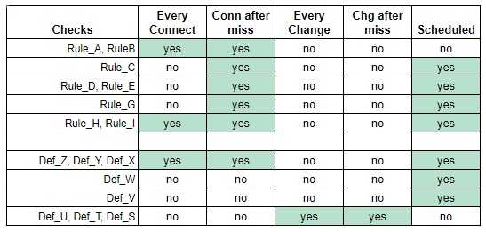

# SCAP Monitoring Overlay Syntax

The OpenC2 Actuator Profile subcommittee examined the *Monitoring Overlay Syntax Proposal*
distributed to the [SCAP email list](https://list.nist.gov/scap-dev-endpoint).  The proposal
includes a description, a diagram representing the description, an example XML serialization,
and an example JSON serialization.  We combined these elements to create a schema to be used
in an OpenC2 actuator profile for Reporting.  That process resulted in come observations
related to the example serializations:

1. The "file binding" from the description is represented by the XML element "\<CheckingFile id=...\>".
Type names never appear in JSON data, so XML element names are used as schema type names.
Where Type names differ from names used in the description, the latter may be included in
schema comments. Attribute names appear in both XML and JSON data, and where they conflict
the schema must resolve the difference.  This will require changes to the serialization
examples: XML can use a "file_id" attribute or JSON can use an "id" property to hold the
"identifier for a specific file containing check content"

2. The periodicity statement contains both standalone "on-connect" and "on-change" elements plus
time intervals that include an on-connect subfield.  We believe the interval subfield can be
removed without loss of generality: the on-connect behavior of a periodicity block should not
depend on where in the block it is specified. The schema refactors the periodicity block to contain:

    * the list of checks
    * the on-connect behavior
    * the on-change behavior
    * the time-based check interval

3. The description says a periodicity statement contains a time interval following *one of* the
following forms.  The schema includes an "interval" property representing the grouping that
is not present in the JSON example.

4. The on_connect value *null* is a different type than "AFTER_MISS" (a string), and "TRUE"
(a string that could be confused with the boolean *true*.)  The schema uses an enumeration
of three values "NO", "YES", and "AFTER_MISS" for consistency.

The resulting schema is contained in the schema directory:
[reporting-v1.0_gen.jidl](schema/reporting-v1.0_gen.jidl), along with machine-readable
source (.jadn) and the generated JSON Schema (.json).

The resulting JSON serialization [reporting-example](data/reporting-example1.json)
is contained in the data directory along with the original JSON serialization
(scap-monitor-overlay) for comparison. The desired result of both is shown in Fig.1:

.

The Python [test_reporting](test_reporting.py) script validates the JSON serialization
against the schema.
