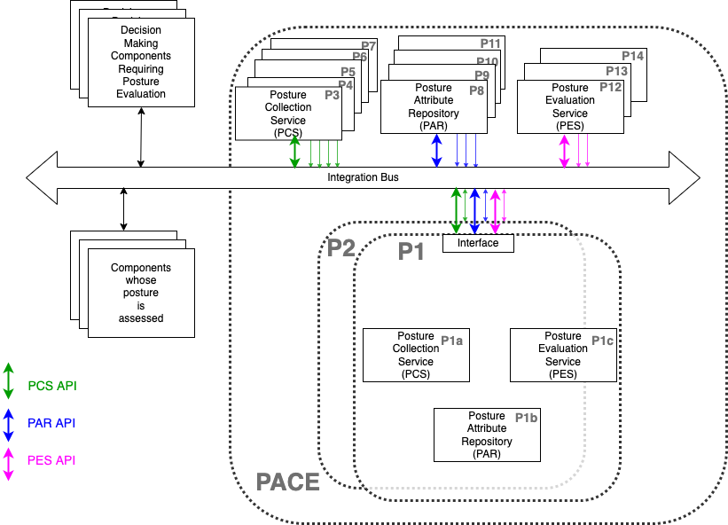

# sFractal at 2022-06 Plugfest

## 1. Introduction
Besides being stuckee on organizing CAW,
sFractal intends to participate in the CAW
with the "sweat equity" in the following sections.

## 2. Software/Application/Device -centric Contributions

### 2.1 BlinkyHaHa, BlinkyMaHa
Physical devices consisting of Raspberry Pi's that implement
the IoT "Hello World" and the OpenC2 "Hello World" over
the HTTP/S and MQTT OpenC2 transfer specifications.

Software at:
- github.com/sparrell/BlinkyHaHa
- github.com/sparrell/BlinkyMaHa

Physical instantiations will be brought to plugfest.
They will not be available remotely
unless I get really creative with a 5G interface.

Status:
- needs a lot of work.
Not touched since last in-person plugfest pre-covid

Hopefully will instantiate:
- "Hello World" custom Actuator Profile
- "Blinky"  custom Actuator Profile
- MQTT OpenC2 Transfer Specification
- HTTP OpenC2 Transfer Specification
- HTTPS OpenC2 Transfer Specification
- OpenC2 SBOM Actuator Profile
- OpenC2 Software Update Actuator Profile
- OpenC2 Packet Filter Actuator Profile

### 2.2 TwinklyHaHa, TwinklyMaHa
Digital twins for BlinkyHaHa, BlinkyMaHa.
I.e. cloud servers that have webpage lights under OpenC2 control.
Hopefully will instantiate:
- "Hello World" custom Actuator Profile
- MQTT OpenC2 Transfer Specification
- HTTPS OpenC2 Transfer Specification
- OpenC2 SBOM Actuator Profile
- OpenC2 Software Update Actuator Profile
- OpenC2 Packet Filter Actuator Profile
- OpenC2 {whatever we call the UMD cloud IAM} Actuator Profile
- OpenC2{whatever we call the cloud instantiation} Actuator Profile

Software at:
- github.com/sFractal-Podii/TwinklyMaHa
- github.com/sFractal-Podii/TwinklyHaHa

Instantiated at:
- http:// twinklymaha.sbompoc.sfractal.com:4000/
   + need to add certs for https
   + needs a lot of work
   + will move to twinklymaha.caw.sfractal.com
- http:// twinklyhaha.sbompoc.sfractal.com:4000/
   + need to add certs for https
   + needs a lot of work
   + will move to twinklyhaha.caw.sfractal.com

Status:
Only minor work since last CAW, focused on making cloud instantiation
easier and more like QuadBlockQuiz.

### 2.3 QuadBlockQuiz
QuadBlockQuiz is a tetrominoes-like game
with quiz questions to get powerups to help with game.
There are OpenC2 quiz questions.
Hopefully by CAW, the webserver will be
instantiated using OpenC2 commands
and security command and control will be
via OpenC2 commands.
Hopefully will instantiate:
- "Hello World" custom Actuator Profile
- MQTT OpenC2 Transfer Specification
- HTTPS OpenC2 Transfer Specification
- OpenC2 SBOM Actuator Profile
- OpenC2 Software Update Actuator Profile
- OpenC2 Packet Filter Actuator Profile
- OpenC2 {whatever we call the UMD cloud IAM} Actuator Profile
- OpenC2{whatever we call the cloud instantiation} Actuator Profile

Software at:
- github.com/sFractal-Podii/quizquadaminos

Instantiated at:
- quadblockquiz.org:4000/

Status:
- needs a lot of work (but core is up and running)

Help on anything appreciated,
but especially on OpenC2 and other quiz questions.
Requires no programming experience,
just markdown e.g.
https://github.com/sFractal-Podii/quizquadaminos/blob/develop/qna/automation/001.md.

### 2.4 Ogres
sFractal will instantiate Open Graph Repository in Elixir for Sboms (OGRES)
[repo](https://github.com/sparrell/Ogres)
as a PACE system
interfaced with Foad (see next section) and
loaded with data from Oser (see next section).

Hopefully by CAW, the webserver will be
instantiated using OpenC2 commands
and security command and control will be
via OpenC2 commands.
Hopefully will instantiate:
- "Hello World" custom Actuator Profile
- MQTT OpenC2 Transfer Specification
- HTTPS OpenC2 Transfer Specification
- OpenC2 SBOM Actuator Profile
- OpenC2 Software Update Actuator Profile
- OpenC2 Packet Filter Actuator Profile
- OpenC2 {whatever we call the UMD cloud IAM} Actuator Profile
- OpenC2 PACE PCS Actuator Profile
- OpenC2 PACE PAR Actuator Profile
- OpenC2 PACE PES Actuator Profile

Software at:
- https://github.com/sparrell/Ogres

Instantiated at:
- not instantiated yet at ogres.caw.sfractal.com

Status:
- just starting

### 2.5 Foad
sFractal will instantiate a
Fake Orchestrator, Actuators, Decision-Makers (FOAD)
[repo](https://github.com/sparrell/Foad)
to test Ogres (and hopefully other PACE systems).

### 2.6 Oser
The Ogres Sbom Examples Repo (OSER)
will contain example SBOMs, VEXs, NVD CVE's, and other "posture attributes"
needed to evaluate/test Ogres and other PACE systems.
Besides being an acronym, Oser is derived from "ose" and "oser".
Ose is the Latin suffix meaning "full of", "abounding in", "given to", or "like".
So in this context, this repo is "abounding in" example data.
Oser means "to dare", as in "Do we dare to start populating this data?" :-)

Only relevant to OpenC2 in that it enables Ogres testing.

Software at:
- https://github.com/sparrell/Oser

Instantiated at:
- this repo will not be instantiated per se. Data from repo will be used by Foad and Ogres and any other projects that want to use the data for testing/demonstration.

Status:
- just starting

### 2.7 CAW website
This website will be used to coordinate and plan the workshop.

Software at:
- haven't made repo yet

Instantiated at:
- not instantiated yet at cybersecurityautomationworkshop.org
- ancillary not instantiated yet at cybersecurityautomationworkshop.com

Status:
- just starting. Domains purchased

### 2.8 DependencyTrack
In no one else does,
then sFractal will instantiate a DependencyTrack website
for use at the plugfest

### 2.9 Lycans
Probably outrunning my headlights
but ideally I'll be using some of the existing lycans
and make some new ones.
"Lycan" is our word for software that "transforms"
OpenC2 commands back and forth to proprietary API's.
It's synonomous with "shifters" that STIX refers to.

Ideally I'd add some simple lycans as proof-of-concept
for PACE PCS- and/or PAR- and/or PES- OpenC2 interfaces to commercial
SBOM products like:
- Cybeats [SBOM Studio](https://www.cybeats.com/sbom-studio)
- Ion Channel [Platform](https://ionchannel.io/#/products)
- Adolus [FACT](https://adolus.com/fact/overview/)
- Vigilant Ops [Insight](https://www.vigilant-ops.com/products/)
- Jitsuin [RKVST](https://www.rkvst.com/)
- and probably a bunch of others I am forgetting.

These new lycans would sit between the bus
and the "interfaces" box
in P1 in the Pace picture in section 3.2.

## 3. Which interfaces in which usecases

### 3.1 Comply to Connect Use cases

need to fill in with
which interfaces in which
example usecases showing
OpenC2 commands to sFractal devices.

### 3.2 PACE Use Cases

sFractal will set up Ogres to be any or all of
P1, P2, P3, P8, P12 in the figure above.
sFractal will set up Foad to simulate
an orchestrator in the upper left of the figure above,
as well as devices in the lower left of the figure above.
BlinkyHaHa, BlinkyMaHa, TwinklyHaHa, TwinklyMaHa,
QuadBlockQuiz, and CybersecurityAutomationWorkshop.com
will be devices in the lower left of the figure above.

### 3.2.1 PCS Use Cases
add more detail and on the 1,2,3,4 in
https://github.com/sparrell/PACE/tree/arch2/docs/Arch#putting-an-sbom-into-pace
with details on the various components, commands, and interfaces.

### 3.2.2 PAR Use Cases
add more detail and on the 3 in
https://github.com/sparrell/PACE/tree/arch2/docs/Arch#putting-an-sbom-into-pace
and on 1,2 in
https://github.com/sparrell/PACE/tree/arch2/docs/Arch#getting-vex-information-from-pace
and on 2,3,4 in
https://github.com/sparrell/PACE/tree/arch2/docs/Arch#putting-an-sbom-into-pace
with details on the various components, commands, and interfaces.

### 3.2.3 PES Use Cases
add more detail and on the 1,2,3,4,5 in
https://github.com/sparrell/PACE/tree/arch2/docs/Arch#evaluating-risk-from-a-new-cve
with details on the various components, commands, and interfaces.

### 3.2.4 Orchestrator Use Cases
add more detail and on the 1,4 in
https://github.com/sparrell/PACE/tree/arch2/docs/Arch#putting-an-sbom-into-pace
and on 1,2 in
https://github.com/sparrell/PACE/tree/arch2/docs/Arch#getting-vex-information-from-pace
and on 1,5 in
https://github.com/sparrell/PACE/tree/arch2/docs/Arch#putting-an-sbom-into-pace
with details on the various components, commands, and interfaces.

### 3.2.5 EndPoint Use Cases
add more detail and on the 2 in
https://github.com/sparrell/PACE/tree/arch2/docs/Arch#putting-an-sbom-into-pace
with details on the various components, commands, and interfaces.

Add usecases where actions need to be taken by the orchestrator
as a result of PES responses e.g. IIA01 and IIID01 in https://github.com/sparrell/PACE/blob/vex2/docs/Pace_Sbom_Vex_Flags_Prioritization/README.md#not_affected-flags
