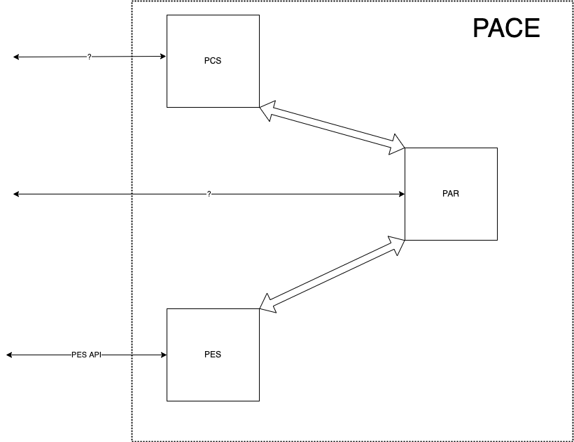

# sFractal at 2022-06 Plugfest
blah blah on overall

## PACE-centric use cases and sw/devices
- blah blah referencing PACE use cases in PACE repo

## OpenC2-centric use cases and sw/devices

## SBOM/VEX-centric use cases and sw/devices

## Twinkly sw/devices and setup

## Blinky sw/devices and setup

## Posture sw/devices and setup

pic

### sfractal-PAR
- graphdb in elixir (maybe neo4j)
- PES/PAR interfaces via OpenC2
- PCS/PAR interfaces via OpenC2
- toy PCS to test PAR interfaces?
- toy PES to test PAR interfaces?
