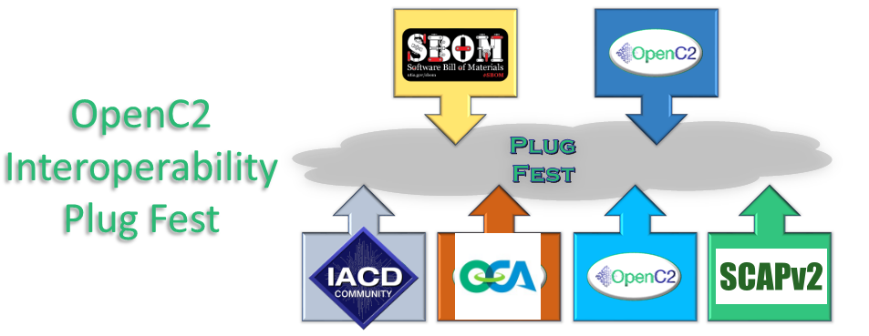

# Table Of Contents
- [1. Intro](#1---intro)
  - [1.1 Vision](#11-vision)
  - [1.2 Communications & Coordination](#12-communications--coordination)
- [2. Organizations Participating](#2---organizations-participating)
- [3. Goals and Objectives](#3---goals-and-objectives)
- [4. Work Plan](4---work-plan)
- [5. Participants](#5---participants)

# 1 - Intro

The intent is to show the value of
automated cyber defense,
which is best shown as complete usecases
involving many concepts.
SBOM-PoC is shorthand for a mashup of the
SBOM/OpenC2/SCAPv2/IACD/CACAO/OCA/MUD/DBOM
virtual
Proof-of-Concept(PoC)/plugfest/hackathon.

This SBOM PoC is a combination of many efforts:
- [OpenC2](https://openc2.org/) - Open Command and Control
- [NTIA SBOM](https://www.ntia.gov/sbom) - Software Bill of Materials
- [NIST SCAPv2](https://csrc.nist.gov/Projects/Security-Content-Automation-Protocol-v2) - Security Content Automation Protocol Version 2
- [IACD](https://www.iacdautomate.org/) - Integrated Adaptive Cyber Defense
- [CACAO](https://www.oasis-open.org/committees/tc_home.php?wg_abbrev=cacao) - Collaborative Automated Course of Action Operations
- [OCA](https://opencybersecurityalliance.org/) - Open Cybersecurity Alliance
- [MUD](https://www.mudmaker.org/) - Manufacturer Useage Description
- [DBOM](https://www.linuxfoundation.org/) Digital Bill of Materials

The SBOM PoC welcomes any who would like to participate.

The SBOM PoC
sets out to prove several concepts e.g.
- [SBOMs](https://www.ntia.gov/sbom)
   - may be used in protecting organizational systems,
   networks, data, and users
   - may be created
   - may be obtained
   - may be used as input in making security decisions
      - e.g. as the "sensing" data feeding "sense-making"
      of vulnerability analysis) using the [IACD architecture](https://www.iacdautomate.org/iacd101)
      - e.g. how SBOMs may be discovered with MUD
      - e.g. "Obtain SBOM" may be used as an SCAPv2 application in the [SCAPv2 Prototype Architecture](https://docs.google.com/presentation/d/11EtTqBsSlfGVnjmudNrTSTpk3-tUUxn90AuucZpenD8)
      - e.g. how "Obtain SBOM" may be done with OpenC2, and how "analyse SBOM" may result in action commands to be carried out with OpenC2
      - e.g. how SBOMs may be part of DBOM
      - e.g. how "analyse SBOM" may be done within OCA framework
      - e.g. how "Obtain SBOM", "analyse SBOM", and subsequent actions may be represented using CACAO playbooks
- [OpenC2](https://openc2.org/)
   - may be used in protecting organizational systems,
   networks, data, and users
   - may be used to command and control (C2) security functions
   - may be used to obtain SBOMs
   - may be C2 in the 'Act' function of IACD
   - develop OpenC2 profiles to support interactions
   within the [SCAPv2 Data Collection Architecture](https://github.com/oasis-tcs/openc2-usecases/blob/master/SBOM-PoC/DoD/07-scap/scap-v2-data-collection-architecture.md)
   - may be used for "Obtain SBOM" as an SCAPv2 application in the [SCAPv2 Prototype Architecture](https://docs.google.com/presentation/d/11EtTqBsSlfGVnjmudNrTSTpk3-tUUxn90AuucZpenD8)
- [SCAPv2](https://csrc.nist.gov/Projects/Security-Content-Automation-Protocol-v2)
   - may be used in protecting organizational systems,
   networks, data, and users
   - demonstrate "Obtain SBOM" as an SCAPv2 application in the
   [SCAPv2 Prototype Architecture](https://docs.google.com/presentation/d/11EtTqBsSlfGVnjmudNrTSTpk3-tUUxn90AuucZpenD8)
   - revised [Architecture](Schemas/scapv2-edc-proto/edc-09-02-2020.pdf) is used to create the
   EDC [schema](Schemas/scapv2-edc-proto/edc.jidl), which in turn is used iteratively to refine the architecture.
   - EDC Application messages become the Targets and Results of the OpenC2 EDC Actuator Profile.
- [IACD](https://www.iacdautomate.org/)
   - may be used in protecting organizational systems,
   networks, data, and users
   - may prove useful in architecting the PoC (e.g.
     sensing/sense-making/decision-making/acting)
   - shows the value of automated defenses.
- [CACAO playbooks](https://docs.oasis-open.org/cacao/security-playbooks/v1.0/csd01/security-playbooks-v1.0-csd01.html)
   - may be used in protecting organizational systems,
   networks, data, and users
   - may be used to identify, create, document, and test detection, investigation, prevention, mitigation, and remediation steps
   - may be used to define the use cases and scenarios of the PoC
- [OCA](https://opencybersecurityalliance.org/)
   - may be used in protecting organizational systems,
   networks, data, and users
   - demonstrate OCA integration and interoperability
   - projects (e.g. [stix-shifter](https://github.com/opencybersecurityalliance/stix-shifter/blob/master/OVERVIEW.md),
   [OpenDXL Ontology](https://github.com/opencybersecurityalliance/opendxl-ontology), and SCAPv2 Prototype)
- [MUD](https://www.mudmaker.org/)
   - may be used in protecting organizational systems,
   networks, data, and users
   - use of MUD for SBOM discovery in both OpenC2 and non-OpenC2 usecases
- [DBOM](https://www.linuxfoundation.org/) Digital Bill of Materials
   - may be used in protecting organizational systems,
   networks, data, and users
   - use of DBOM for SBOM in both OpenC2 and non-OpenC2 usecases

See [Section 2](#2---organizations-participating)
for organizations participating
and how their goals tie to these efforts.

See [Section 3](#3---goals-and-objectives)
for goals and objectives of each of these.

See [Section 4](#4-work-plan) on how the work will be organized

See [Section 1.2](#12-communications--coordination)
and [Sections 5](#5---participants) for details for the participants

## 1.1 Vision
The vision of this activity is that it will prove several concepts
associated with several independent efforts (e.g. OpenC2, NTIA SBOM,
SCAPv2, IACD, OCA, ...).
This work is intended to be virtual
(ie no physical meetings needed)
and consist of many pairwise
interworking steps growing to larger many-party working scenarios or use cases.
Examples of scenarios include:
- an automated response to an attack on a device which did not create an SBOM. See https://youtu.be/9KnagMQ6SNI at ~3 min 10 sec as example
- a device coming online in a network, it's SBOM being queried with OpenC2, and:
    - device does not have SBOM, so orchestrator denies access to network
    - device has SBOM, sense making looks up components and discovers vulnerabilities exist, so orchestrator:
       - sandboxes device,
       - automagically installs component updates (including updating SBOM,
       - allows access to network
    - device has SBOM, sense making looks up components and discovers vulnerabilities exist, so orchestrator allows access
- ditto previous with mud (either standalone or in combination with OpenC2)
- an automated response to an attack on a device which did create an SBOM, and had automated update when CVE annouced . See  https://youtu.be/9KnagMQ6SNI at ~4 min 50 sec as example
- the Denver Airport Scenarios from Jan Plugfest
- the firewall scenarios from the Jan Plugfest
- setting up the (multi-)cloud instances using OpenC2 (using New Context and AT&T opensource)
- some megascenario combining them all

Scenarios will have plans (e.g. see
[sFractal Scenario 1 work plan](./ParticipantInfo/sFractal/workPlan.1.md))
including flowchart (e.g.

with draw.io
[source](./ParticipantInfo/sFractal/sFractal.1.drawio)),
human readable scenario (e.g.
[sFractal Scenario 1](./ParticipantInfo/sFractal/README.md#31---comply-to-connect))
and ideally CACAO playbooks (e.g.
[sFractal playbook 1](./ParticipantInfo/sFractal/cacaoPlaybook.01.json)).

This effort is scheduled from June thru October 27, 2020
and will terminate just prior to
[TTD-PlugfestHackathon](../TTD-PlugfestHackathon)
when there will be a virtual meetup/mashup
will an all-day zoom of all participants.
The effort from now until 27-October
is being called Phase 1 with the hope
there will be follow on work after the [28-Oct Meetup](../TTD-PlugfestHackathon) that can be accomplished virtually
(i.e. that there will be a Phase 2 after the meetup).

## 1.2 Communications & Coordination

**Communications Options** for Plug Fest participants:

- OASIS-managed mail list:  `openc2-plugfest-2019@lists.oasis-open.org` -- Originally
established for the January 2020 plug fest, we are continuing to use this list for the
new event. If you wish to be added to (or removed from) the list, contact David Lemire
(`david.lemire@hii-tsd.com`) for assistance

- Plugfest channel on Discord:  The HII software team maintains a Discord server, and
we've established a channel for the plugfest. This channel is open to non-OASIS member
plug fest participants. A [Discord account](https://discord.com/register) is required.
To request a link to join the server, contact David Lemire (`david.lemire@hii-tsd.com`)
or Danny Martinez (`danny.martinez@hii-tsd.com`)

- Plugfest channel on Slack:  the OpenC2 TC has a Slack community and there is a
plugfest channel there. Unfortunately this option is limited to plugfest
participants who are also OpenC2 TC members.

**Coordination Meeting**: There is a bi-weekly coordination meeting conducted via WebEx
every other Thursday at 11:00 am EDT.  Contact David Lemire (`david.lemire@hii-tsd.com`)
to request an invititation to the meeting series.  Planned meeting dates are 30 July,
13 August, 27 August, ...

# 2 - Organizations Participating
Here is the list of organizations who have agreed to participate,
in order of volunteering to participate in PoC,
hotlinked to pages showing what they are interested in
and what they plan to contribute to this effort:
- [sFractal Consulting](./ParticipantInfo/sFractalGoals.md)
- [NSA](./ParticipantInfo/NSAGoals.md)
- [Huntington Ingalls Industries](./ParticipantInfo/HIIGoals.md)
- [New Context](./ParticipantInfo/NewContextGoals.md)
- [NineFx](./ParticipantInfo/NineFx.md)
- [One Planet Education Network](./ParticipantInfo/OnePlanetGoals.md)
- [AT&T](./ParticipantInfo/AttGoals.md)
- [mudmaker.org](./ParticipantInfo/MudMakerGoals.md)
- [Ion Channel](./ParticipantInfo/IonChannelGoals.md)
- [Unisys](./ParticipantInfo/UnisysGoals.md)
- [BTS](./ParticipantInfo/BtsGoals.md)
- [Google](./ParticipantInfo/GoogleGoals.md)
- [Podii](./ParticipantInfo/PodiiGoals.md)
- [University of Oslo](./ParticipantInfo/UiOGoals.md)

Editor's Note - This list probably needs to move to it's own page
since it will probably grow to 50+ entries.
And Goals-per-organization will need to move to a subdirectory

# 3 - Goals and Objectives
This effort is a mashup of several efforts
by a combination of many organizations,
all with goals related to one or more of the efforts.
The organization goals/objectives pages (see [Section 2](#2-organizations-participating))
will be combined into individual pages per effort:
- [OpenC2 Plugfest/Hackathon Goals & Objectives](./Oc2Goals.md)
- [NTIA SBOM Transfer PoC Goals & Objectives](./SbomGoals.md)
- [IACD Goals & Objectives](./IacdGoals.md)
- [CACAO Goals & Objectives](./CacaoGoals.md)
- [Opencyber Security Alliance Goals & Objectives](./OcaGoals.md)

# 4 - Work Plan
The work will be organized using the following terms,
mostly cribbed from SBOM Healthcare PoC:
- Phase 1- The work done virtually from now
until [TTD-PlugfestHackathon](https://github.com/sparrell/openc2-lsc-usecases/tree/master/TTD-PlugfestHackathon)
- Sprint - the interval between the biweekly status
meeting (e.g 4-June-2020 to 18-June-2020)
- Interval - An interval consists of several sprints.
Phase 1 will be broken into at least 3 intervals
described [here](./WorkPlanIntervals.md)
with discrete objectives (e.g. interval 1 focus
is on 'within an organization',
interval 2 on between an organization lab and a cloud,
interval 3 on org1-cloud-org2, ...)
- Wave - a subset of an interval meeting a subset of the objectives.
An Interval is broken into waves usually due to different
organizations having deliverables arriving at different times. E.g.
in the Healthcare SBOM PoC, Interval 1 was broken into two waves so
the initial 13 MDD SBOMs could start being evaluated by the HDOs
without having to wait for the 'wave 2' SBOMs.
- Use case/Scenario - for this effort, the terms will be used
somewhat interchangeably to describe the scenarios being simulated
in this PoC to simulate the real life uses of the concepts being
proved. The expectation is the scenarios will start out simply in
pair-wise interactions and grow to complex scenarios involving all
aspects of the IACD architecture (ie sensing, sense-making, decision
making, acting) showing cyber defense at machine speed.

See the [Work Plan](./WorkPlan.md) for more details.

# 5 - Participants

The [Plugfest Players](https://github.com/oasis-tcs/openc2-usecases/wiki/OpenC2-Plugfest-Players) Wiki is a place to advertise and coordinate test interactions.
