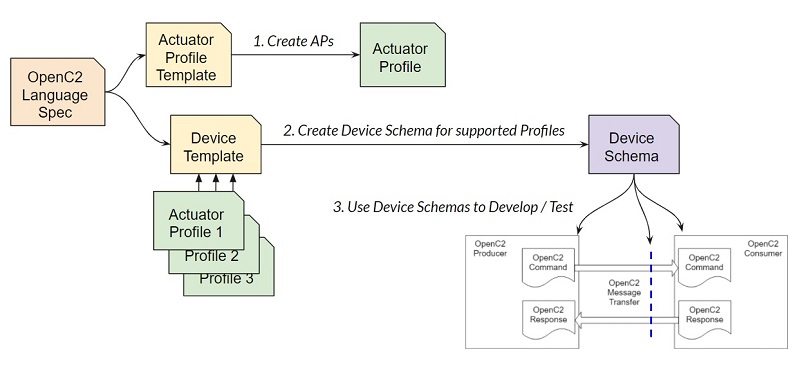

# OpenC2 v1.1 Plugfest Schemas
Expanding on the actuator profile
[overview](https://github.com/oasis-open/openc2-custom-aps/blob/master/Schema-Template/README.md),
this document steps through the process of creating a new actuator profile and then using that profile to create
a device schema to support development and interoperability testing:

It uses an OpenC2 controller for
[LED display panels](https://www.amazon.com/panels-digital-module-display-P3-19296mm/dp/B079JSKF21)
as an example. Using a toy example separates the mechanics of profile creation from unnecessary consideration
of cybersecurity functionality.
Following the Sparrell naming scheme we'll call this the "[blinky](https://github.com/sparrell/BlinkyHaHa)"
profile, but it is intended to support a range of LED matrix displays including the Sparrell device.

* **Project Name:** blinky

#### 1. Select Namespace
OpenC2 (and other specifications) reference each actuator profile's definitions using its unique identifier,
aka namespace. Select a namespace for this profile as described in the OpenC2
[Namespace Registry](https://github.com/oasis-tcs/oc2arch/blob/master/namespace-registry.md):

* **Specification:** Hello-World LED Display Custom Actuator Profile
* **Namespace:** https://oasis-open.org/openc2/custom/blinky/v1.1

#### 2. Select Actions and Targets
Define an initial set of commands that accomplish the goals of the profile. Here "ap_name" means "this profile",
since the name referencing this profile is defined (and can be changed) by the OpenC2 language schema (step 5).

* query features: required by OpenC2
* query ap_name/device: We want to know something about the physical or virtual actuator.
* set ap_name/display: We want the actuator to display something.

Additional actions and targets may be defined later.

#### 3. Create the blinky profile schema
* Copy the
[Actuator Profile Template](oc2-language/oc2ls-v1.1-ap-template.jidl)
to the project's schema file 'blinky.jidl'.
* Delete all unused actions, targets, args and results from the template lists.

The lists published in an actuator profile select which OpenC2 types are used. Types are defined
in the language specification and cannot be modified by profiles. Comments may describe any profile-specific
meaning of OpenC2-defined types.

#### 4. Define profile-specific types
We mentioned two profile-defined targets (device and display) above.  Define their contents as fields of AP-Target.
Define the desired response format for these commands as fields of AP-Results. ([Show](images/ap-template-device.jpg)).
Note that this example defines a "Device" type, which also happens to be the name of an OpenC2 Target.
Namspaced type references (ls:Device, led:Device) allows both definitions to be used without conflict.

The first section of the profile is a set of string enumerations (Action, Target, Args, Specifiers, Results, Pairs)
that are not referenced by other types. They represent information about a profile that does not appear in
OpenC2 messages. Omitting a name from the Action/Target/Args/Specifiers/Results lists indicates that the device
using the profile does not support it. The Pairs list allows a Producer or Consumer to construct the Map
returned by "query features pairs". It is a set of strings, each containing an action followed by the targets
applicable to that action, equivalent to the Map returned by "query features pairs". The Pairs type is ad-hoc;
its name is not reserved and JADN does not define a standard way to convert it to a pairs result.

* In Pairs, delete all actions not supported by the profile and add the fields of Target and AP-Target
(preceded by /) applicable to that action.

After defining the device-specific content, the blinky profile schema should look like
[blinky.jidl](blinky/blinky.jidl). This schema, in text or table ([blinky.md](blinky/blinky.md)) format,
forms the basis for the actuator profile document.

#### 5. Generate device schemas
Once the actuator profile has been created, we can generate a schema for a device starting with the
[Device Template](oc2-language/oc2ls-v1.1-lang.jidl).
Note that the Device Template is just the OpenC2 Language schema with placeholders for actuator profiles. Deleting
the profile placeholders results in a hypothetical "OpenC2 device" schema, a producer or consumer that
supports everything defined in the language spec and nothing else. Standardizing such a device would require a
profile that specified conforming behavior for *every* language element. Real actuator profiles have more limited scope.

The OpenC2 language specification contains a list of profile ids/names;
choose nonconflicting values for each of the profiles supported by the device.
NSIDs are local to the device schema and may be chosen arbitrarily.
A profile name may be used as its NSID, but NSIDs should be short. Assign an NSID other than the profile name
to illustrate the difference:

* **Profile ID, Name:** 2000, blinky
* **Namespace ID:** led

In the device schema:

* delete actions, targets, args and results that are not used by any of the referenced profiles.
* in Target, Args, Specifiers, and Results replace the id and name (0, ap_name) placeholders
with actual values (e.g., 2000, blinky) chosen for each supported profile.
* in AP-Target, AP-Args, AP-Specifiers and AP-Results, and in the "imports" section, replace the nsid placeholders
with the NSIDs for each supported profile.
 
After deleting unused language elements and filling in profile data, the example should look like the
[device-b schema](blinky/device-b.jidl).

#### 6. Resolve device schema
With suitable infrastructure the "device-b" schema is used directly, with the device retrieving all referenced
type definitions by namespace. If the device cannot resolve references it will need a single schema
([device-b_resolved](blinky/device-b_resolved.jidl)) containing all referenced definitions.
The resolved schema is normally generated using schema tools, but can be created manually by copying
definitions from the referenced schemas. For testing convenience the resolved
schema may also be stored in machine-readable [JADN](blinky/device-b_resolved.jadn) or
[JSON Schema](blinky/device-b_resolved.json) formats.

#### 7. Create test data
Create four directories "Good-command", "Good-response", "Bad-command", and "Bad-response" in the directory
containing the resolved schema. Create good and invalid test messages in these locations.
Using a standard directory structure allows testing software to locate and validate test data for multiple profiles.
Note that in some cases a message may be either good or bad depending on the capabilities of the device and whether
conformance requires support for the capability.

#### 8. Validate test data
The Python script [test-poc.py](test-poc.py) will validate test data against the schema for all projects.
Before running the script, obtain a GitHub
[personal access token](https://docs.github.com/en/github/authenticating-to-github/creating-a-personal-access-token)
and save it in environment variable "GitHubToken".  (Or if you have already created a token, modify the script
to use it.) Without a token the GitHub request rate is severely limited.

**Note on data formats:**

The January Plugfest used [Test Data](https://github.com/oasis-open/openc2-custom-aps/tree/master/Test) extrapolated
from two confusing JSON examples shown in the
[Language Specification V1.0 CS02](https://docs.oasis-open.org/openc2/oc2ls/v1.0/cs02/oc2ls-v1.0-cs02.html), in
section 3.1.4 (Extensions) and Annex C.  Version 1.1 of the LS is expected to correct errors in the Extensions
section and align the examples with the JSON Pointer standard (RFC 6901) and the Namespace Registry.

Summary:
1) Property names do not contain special characters such as colon or slash.
2) A JSON Pointer is a string containing property names separated by slashes, e.g., "abc/def/gh". A pointer
string is used to refer to properties with namespaced types, such as the results returned by query features pairs.
3) There is no distinction between property names for standard or custom profiles.
Properties named "blinky", "x-blinky", "led", "src", "dst", etc. may all be used by a schema to reference
types defined in the "http://oasis-open.org/openc2/custom/blinky/v1.1" namespace.