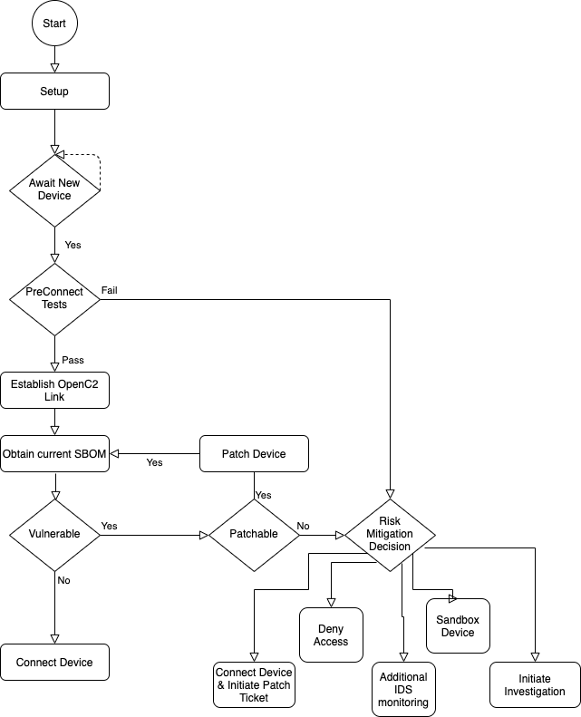

# Table Of Contents
- [1 Intro](#1---intro)
- [2 Scenario Planning](#2---scenario-planning)
- [## 3 - Scenarios](#3---scenarios)
- 

## 1 - Intro
The Software Bill Of Materials (SBOM) Proof of Concept (PoC)
sets out to prove several concepts e.g.
- SBOMs
   - may be used in protecting organizational systems, networks, data, and users
   - may be created
   - may be obtained
   - may be used to make security decisions
- Openc2
   - may be used in protecting organizational systems, networks, data, and users
   - may be used to obtain SBOMs
   - may be used to command and control security functions
- CACAO playbooks
   - may be used in protecting organizational systems, networks, data, and users
   - may be used to identify, create, document, and test detection, investigation, prevention, mitigation, and remediation steps

## 2 - Scenario Planning
Scenario planning is not correct name for this Section

blah blah on how each scenario is it's own subdirectory and
consists of a text explanation in the README,
a diagram showing the flow,
one or more CACAO playbooks of the flow,
and a page documenting either the plan, the status, and/or the results
depending on what has been done.
Playbooks may reference playbooks in other scenarios.

blah blah on the big picture (maybe some of the megascenarios?) and
a heirarchical list of the scenarios sFractal intends to be involved in
(maybe this belongs up a level and is for everybody's scenarios?)

blah blah on work plan has specific tasks to make specific scenarios in specific configurations work.

## 3 - Scenarios

### 3.1 - Comply to Connect
This is a collection of scenarios that follow the general flow shown in
Figure 3.1-1

This is a collection of scenarios that differ by the details
in the blocks, or different devices are use, or differ by what is used as the orchestrator or what policies are in the orchestrator.

For example, decisions may be done manually be humans
or by an orchestrator.

Another example is the 'obtain current SBOM' may be done by:
- OpenC2 command to the device
- MUD command to the device followed by OpenC2 command to the device
- MUD command to the device followed by http to a public vendor website
- email request to the supplier followed by supplier emailing SBOM back
- ...

### 3.1,1 - Comply to Connect sFractal Scenario 1

The as-built architecture is:
- make a picture
- {add link here} is the CACAO playbook
- human as orchestrator
- blinkyhaha-1 as device (valid sbom)
- Setup is blah blah
- preconnecttest is hand waving for this scenario
- detect new device and preconnect is manual
- OpenC2 link is HTTPS
- Obtain current SBOM is done using OpenC2 'query feature sbom' command per {add json}
- Connect device is hand waving for this scenario

The sunny day path thru this scenario:
- Setup
- Add device
- Pass preconnect
- Establish OpenC2 link
- Valid, vulnerability-free, licensing-compliant SBOM is obtained via OpenC2 'query feature sbom'
- Human orchestrator hand waves to connect device.

Other scenarios derived from this scenario:
- rainy day scenarios:
   - no SBOM
   - SBOM has vulnerability and device can be patched via OpenC2 command
   - SBOM has vulnerability and patch not available
   - SBOM has licensing issue
   - exercise all risk mitiation paths
- pub sub OpenC2
- SBOM via public URL or via email
- MUD discovery of SBOM
side note - add ids to risk mitigation choices
