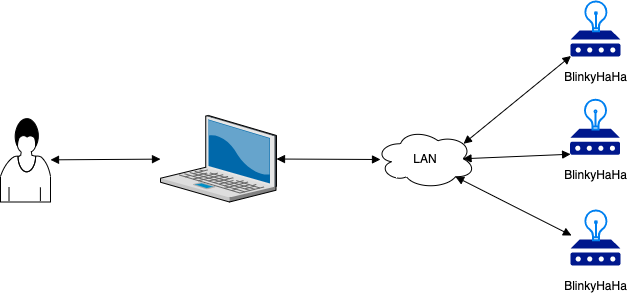
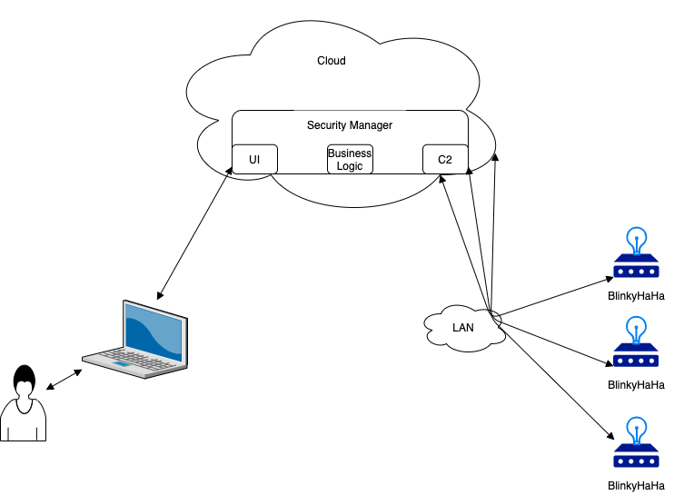

# sFractal Work Plan
add toc

## 1 - Intro
Scenarios have many dimensions:
- sFractal-alone or sFractal in collaboration with others
- component architecture
- flow (ie operational concept to be proved)
- configuration

A numbering scheme will be trialed to see if it
makes it easier.
sFractal Scenario 1.1.1 is:
- Participants (ie sFractal)
- Architecture (ie sFractal 1 is [sFractal Arch 1](./arch.01.trivial.pi.lan.png)). See Section 2 for the architectures to be used
- Flow (ie sFractal 1.1 is  [Flow 1 - Comply to Connect](./sFractal.1.png).See ...
- Configuration
   - sFractal 1.1.1 is sunny day. Ie on the flow:
      - Precheck passes
      - SBOM exists
      - SBOM passes license checks
      - SBOM passes vulnerability checks (ie has no known vulnerabilities)
    - 1.1.2-1.1.n are various rainy days - precheck fails, sbom nonexistent, licensing issue, sbom vulnerabilities, exercise the different risk detection mitigations (trouble ticket, deny access, extra IDS monitoring, sandbox, initiate investigation). Main configuration change is different SBOMs.

## 2 - Component Architecture

### 2.1 - sFractal Architectures

The sFractal architecture (collaborations shown later) will evolve as follows:

Figure 2-1

Figure 2-2

Figure 2-3

Figure 2-4

Figure 2-5

Figure 2-6

### 2.2 - sFractal/HII Architectures
several dimensions:
- OIF-producer as "security manager"
- OIF-device as device in addition to Blinky
- Yukki ?
- schema generator?

## 3 - Flow

Figure 3.1-1:

## 4 - Configuration
- human as orchestrator
- blinkyhaha#? as device
- SBOM version ? at {need link}
- OpenC2 as SBOM discovery, access
- OpenC2 for security actions
- HTTP (ie not HTTPS, save that for later)
- ...

## 5 - Playbook
- CACAO playbook at [sFractal playbook 1](./cacaoPlaybook.01.json)

## 6 - Tasks
- make work plan, scenarios, Architectures
- make sboms for all blinkyhaha
- https setup for https openc2 BlinkyHaHa
- code MQTT for BlinkyHaHa
- https://www.openhab.org/about/who-we-are.html
- how use google credits
- how switch between aws/gcp using https://github.com/newcontext-oss/openc2-aws-actuator and or https://github.com/att/openc2-aws
- update https://github.com/sparrell/SBoM-by-example/blob/master/blinky_how_to.md
- how to use https://github.com/oasis-open/openc2-lycan-python

## 7 - Status
As of 6/10/20

Still planning

## 8 - Next Steps and Schedule
still planning

## 9 - Results

None yet
