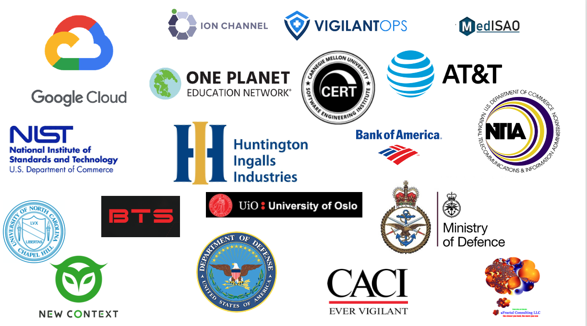

Register [here](https://www.eventbrite.com/e/sbom-poc-openc2-plugfest-hackathon-tickets-124335150783)

# Table Of Contents
- [1. Intro](#1---intro)
   * [1.1 OpenC2](#11-openc2)
   * [1.2 SBOM](#12-sbom)
   * [1.3 IACD](#13-iacd)
   * [1.4 OCA](#14-oca)
   * [1.5 SCAPv2](#15-scapv2)
   * [1.6 CACAO](#16-cacao)
   * [1.7 Impact of Covid](#17-impact-of-covid)
- [2. Agenda](#2---agenda)
- [3. Registration](#3---registration)
- [4. Meetup Logistics](#4---meetup-logistics)
   * [4.1 - Conference Tools](#41-conference-tools)
   * [4.2 Ecosystems ](#42-ecosystems)
   * [4.3 Projects to interwork ](#43-projects-to-interwork)
   * [4.4 Open Source Repos of interest](#44-open-source-repos-of-interest)
   * [4.5 Breakout sessions ](#45-breakout-sessions)

# 1 - Intro

There is no better time
to be in the cyber-security profession than today.
We are faced with interesting problems
and we address the needs of new functionality
within evolving cyber-ecosystems.
We are seeing an expansion in the
cyber-physical (such as robotics and self driving cars)
and an increase in the abstract (such as cloud migration,
artificial intelligence and machine learning).
Cyber-security is a most rewarding profession to be in,
but there are associated challenges.
We need the experts to be able
to focus their efforts and permit their innovations
to be applied to a range of uses regardless of the cyber-ecosystem.

This is where efforts such as
OpenC2, SBOM, IACD, OCA, SCAPv2 come in.
The OpenC2 Plugfest/SBOM PoC/Hackathon
is a mashup of combining all these concepts
to demonstrate usecases showing the value of automated defense.

## 1.1 OpenC2
[OpenC2](https://openc2.org/) is a standardized language
for the command and control of technologies
that provide or support cyber defenses.
By providing a common language for
machine-to-machine communication,
OpenC2 is vendor and application agnostic,
enabling interoperability across a range of cyber security tools
and applications.
The use of standardized interfaces and protocols enables
interoperability of different tools,
regardless of the vendor that developed them,
the programming language they are written in
or the function they are designed to fulfill.
OpenC2 has an initial suite of specifications written
and we are at the point where we are applying it to
real world use cases on real cyber security products.

## 1.2 SBOM
A [Software Bill of Materials](https://www.ntia.doc.gov/SBOM) (SBOM) is a formal record containing the details andsupply chain relationships of various components used in building software.

## 1.3 IACD
[Integrated Adaptive Cyber Defense](https://www.iacdautomate.org/) (IACD) is accelerating the speed and scale of cyberdefense through automation, orchestration, and information sharing. IACD defines a strategy and framework to adopt an extensible, adaptive, commercial off-the-shelf (COTS)-based approach. Our goal is to dramatically change the timeline and effectiveness of cyber defense via integration, automation, orchestration and sharing of machine-readable cyber threat information.

## 1.4 OCA
The [Open Cybersecurity Alliance](https://opencybersecurityalliance.org/)
(OCA) is an open ecosystem
where cybersecurity products interoperate
without the need for customized integrations.
Using community-developed standards and practices,
OCA is simplifying integration across the threat lifecycle.

## 1.5 SCAPv2
[Version 2 of the Security Content Automation Protocol](https://csrc.nist.gov/projects/security-content-automation-protocol-v2)
(SCAPv2) is a major update to the SCAP 1.x publications.
SCAP v2 covers a broader scope in an attempt
to further improve enterprise security through
standardization and automation.

## 1.6 CACAO
[Collaborative Automated Course of Action Operations](https://www.oasis-open.org/committees/tc_home.php?wg_abbrev=cacao)
(CACAO) defines the schema and taxonomy for cybersecurity
playbooks and how cybersecurity playbooks can be created,
documented, and shared in a structured and standardized way
across organizational boundaries and technological solutions.

## 1.7 Impact of Covid
OpenC2 organized a Plug Fest that was to take place
in conjunction with
[Technology Transfer Days](https://techtransferdays.org/).
The Plug Fest was intended to encourage participation
beyond the individuals from 39 different organizations
that are on the OpenC2 effort within OASIS,
and to include the larger ecosystems
OpenC2 operates in (IACD, OCAS, SCAPv2, OCA, …).

The physical OpenC2 plugfest was cancelled
when TechTransferDays
was cancelled due to the pandemic.
It is being replaced with a virtual Meetup on October 28th.
More details will be published here as they are determined.
The details will be worked out as part of the SBOM-PoC.
See [SBOM Proof of Concept](../SBOM-PoC/)
for details on the work leading up to the plugfest..

SBOM-PoC will be used as the shortened version of the
SBOM/SCAPv2/IACD/OCA/CACAO/...
virtual PoC/plugfest/hackathon
that is occurring up until 27-Oct.
Plugfest will be shorthand for the
SBOM/SCAPv2/IACD/OCA/CACAO/...
virtual PoC/plugfest/hackathon
event on Oct 28th
but realistically it will probably be called SBOM-PoC as well.

Organizations participating include:

# 2 - Agenda
The draft agenda is [here](./poc_agenda.md)

# 3 - Registration
Registration will be via Eventbrite and is open. Register [here](https://www.eventbrite.com/e/sbom-poc-openc2-plugfest-hackathon-tickets-124335150783)

You can register as a participant
(i.e. you want to attend at least one of the breakout sessions)
or as an attendee
(i.e. you will just be listening to plenary sessions).
There are several questions that need to be answered to register.
This will help us with planning.

# 4 - Meetup Logistics
## 4.1 Conference Tools
The plenary sessions will via zoom and
access to Zoom will be provided via the Eventbrite tickets.
Breakout sessions
will be using Discord,
and maybe Zoom rooms.
Participants (and attendees if they request) will be provided
Discord information after they register and before the event starts.

## 4.2 Ecosystems
Unlike previous OpenC2 plugfests,
we will not be physically in the same room
and therefore will not be on the same network.
Therefore we will need to interwork our devices remotely.

At the moment, 3 ecosystems are planned:
- HTTP HTTPS - OpenC2 producers interact with OpenC2 consumers virtual HTTP or HTTPS.
This may be challenging for consumers behind firewalls
since the consumer performs the sever role
so it would require opening up either port 80 (HTTP) or port 443 (HTTPS).
For HTTPS, participants should work our certificates
prior to the plugfest.
- MQTT MQTT/TLS - This is the preferred ecosystem.
Since MQTT is a simple pub/sub protocol,
it avoids the firewall issues of HTTP/HTTPS.
See (add link) for broker details.
- OpenDXL - an OpenDXL broker has been established in GCP for the SBOM PoC.
See (add link) for broker details.

## 4.3 Projects to interwork
- [Huntington Ingalls OIF](needtoaddlink)
- [Huntington Ingalls Yuuki](needtoaddlink)
- [sFractal Blinky et al](needtoaddlink)
- [DoD JADN](needtoaddlink)
- [DoD Actuator Profile Tool](needtoaddlink)
- [MoD/CACI  whatisname](needtoaddlink)
- [New Context whatisname](needtoaddlink)
- [Ion Channel SaaS](needtoaddlink)
- [BTS Centurion](needtoaddlink)
- [BTS Legion](needtoaddlink)
- [UNC Honeypots?](needtoaddlink)
- [Univ of Oslo fw?](needtoaddlink)

## 4.4 Open Source Repos of interest
- fill in with repos from OASIS, ATT lycan-python/lycan-java, New Context AWS/newp, HII yuuki, DoD tools, SEI SBOM generator, Google, etc

## 4.5 Breakout sessions
see [Breakouts](./breakouts.md)
