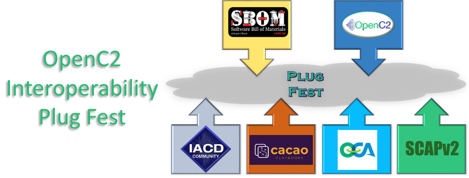

# Agenda 28-Oct-2020
All times are Eastern US and
subject to change based on
attendance, will of the group,
and whim of the moderator.

Please note that on 28-Oct the US will still be on Daylight Savings Time but Europe will have switched to standard time on 25-Oct. We unfortunately scheduled during the confusing week.

Register [here](https://www.eventbrite.com/e/sbom-poc-openc2-plugfest-hackathon-tickets-124335150783)

* 7:45 AM - 8:00 AM - Zoom open, watercooler conversation
* 8:00 AM - 9:45 AM - Breakout Sesson #1
   - Topics arranged pre-plugfest
   - [Details](./breakouts.md)
* 9:45 AM - 10:00 AM - Break
* 10 AM - 11 AM or longer? - Opening Plenary Session
   - Kickoff - Duncan Sparrell
      * Review Logistics
      * Review/Rearrange Agenda
   - 3-4 min Ecoystem Lightning Roundrobin
      * OpenC2 :white_check_mark:
      * SBOM :white_check_mark:
      * IACD :white_check_mark:
      * SCAPv2 :white_check_mark:
      * OCA :white_check_mark:
      * CACAO :white_check_mark:
      * OASIS :white_check_mark:
      * CERT SwiftBom :white_check_mark:
      * Infrastructures - Http/MQTT/OpenDxl, OASIS Open source repos :construction:
   - 3-4 min Project/Company/Usecase Lightning roundrobin videos
      * sFractal :white_check_mark:
      * BTS :white_check_mark:
      * Vigilant Ops :white_check_mark:
      * McAfee :white_check_mark:
      * Huntington Ingalls - Yuuki :white_check_mark:
      * One Planet Education Network :white_check_mark:
      * Podii :construction:
      * NSA/DoD - :white_check_mark:
      * Hereuco :construction:
      * New Context :construction:
      * Ion Channel :construction:
   - 3-4 min Project/Company/Usecase Lightning roundrobin Live
      * Huntington Ingalls - OIF :information_desk_person:
      * Univ of Oslo :question: :information_desk_person:
      * UNC :question: :information_desk_person:
      * NEC :question: :information_desk_person:
* 11:00 - 12:30 Breakout Sessions #2
   - [Details](./breakouts.md)
* 12:30 - 1:00 Lunch Break
* 1:00 - 2:30 Keynote Plenary Session
   - Sally Grant
      * *Session Chair*
      * Lucd.ai
   - Audrey Long
      * *Moderator*
      * Microsoft
   - Wende Peters
      * *A View from the Other Side of the Valley:  Operational and Business Drivers for Automation and Open Standards*
      * Senior Vice President, Global Information Security, Technology Strategy, Orchestration and Production Delivery
   - Michael Powell
      * *Securing integrated ICS and IT*
      * NIST
   - Jason Calloway
      * *Linux Foundation Red Team Project: Using Offensive TTPs to Make Open Source Software Safer to Use*
      * Google
   - Allan Friedman
      * *How We Learned to Stop Worrying and Love the SBOM*
      * Director of Cybersecurity Initiatives, NTIA
   - Neal Ziring
      * *Automating Cyberdefense*
      * Technical Director, Cyber, NSA
* 2:30 - 2:45 Break
* 2:45 - 4:00 Breakout Sessions #3
    - [Details](./breakouts.md)
* 4:00 - 5:00 Closing Plenary & Virtual Happy Hour
   - Breakout Session Readouts
   - Accomplishments Recap
   - Do it again?
      * Virtual in Feb 2021?
      * As part of RSA Supply Chain Sandbox?
         - RSA is 17-20 May, 2021 in San Francisco & Virtual
      * As part of TTD?
         - TTD is 20-24 Sep, 2021 in NYC
      * all of the above!
    - Happy Hour!
